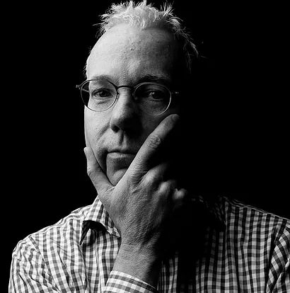

# About Me

## Kevin McQuown

  

*About Kevin*

I graduated from IIT with a B.S. in Computer Science with a Digital Electronics focus. After graduation, I was hired by General Dynamics (now Lockheed) where I spent several years working on embedded avionics development for special projects as the chief architect. I spent many years working for Rational Software as an embedded software architecture consultant, eventually running their professional services organization, worldwide.

I have been developing iOS mobile apps ever since there was the first iOS SDK. I have taught iOS for several years and have developed a high-school curriculum that is now deployed at over 9 high-schools throughout the Chicago metropolitan area as well as an App Dev with Swift Course for Chicago Public Schools.

I was CTO for-hire for Guard Llama and was the CTO and co-founder of Glance Displays Inc. I founded Windy City Lab in 2014 to provide consulting and education in the IoT space which is what I am currently doing full-time.

My passion is applying my skills across a broad spectrum of disciplines to build a physical product. This includes embedded development in C/ C++, mobile development in Swift, cloud development in Node, schematic and PCB design, and 3-D CAD design. 

I also love to mentor and teach. I regularly do workshops on IoT and also teach a 3-week IoT Engineering class to gifted high-schoolers at Northwestern University each summer.

*Some fun facts (in no particular order):*

* I was born and raised in Chicago. It has come a long way since I was a kid. 
* I got my private pilot's license in 1983. No, I'm not still current but I still have my log book. 
* I'm a dog lover and have two boxers, currently, Iggy and Ogden.
* I love to play piano and no, I'm not very good.
* I built my own astrophotography observatory in the countryside of Santa Rosa, CA. My focus was on deep-sky photography, ie. galaxies and nebulae rather than planetary.
* I'm the photographer in the family.  I shoot with a  Sony A7SII mirrorless and love it. 
* I'm a Trekkie. I really don't see what all the fuss is about Star Wars. Sorry. 
* I was very lucky that I became intrigued with computers at a very young age and pursued it both in high-school, college and throughout my career. My first computer was the Apple-II Plus computer. Maybe I'll buy one on E-bay someday and restore.
* I'm a big Carl Sagan fan. Watched his original Cosmos series as a kid and was completely enthralled.
* I'm also a big Stephen Covey fan. His 7-habits were right-on. I especially love the "Big Rock" analogy.
